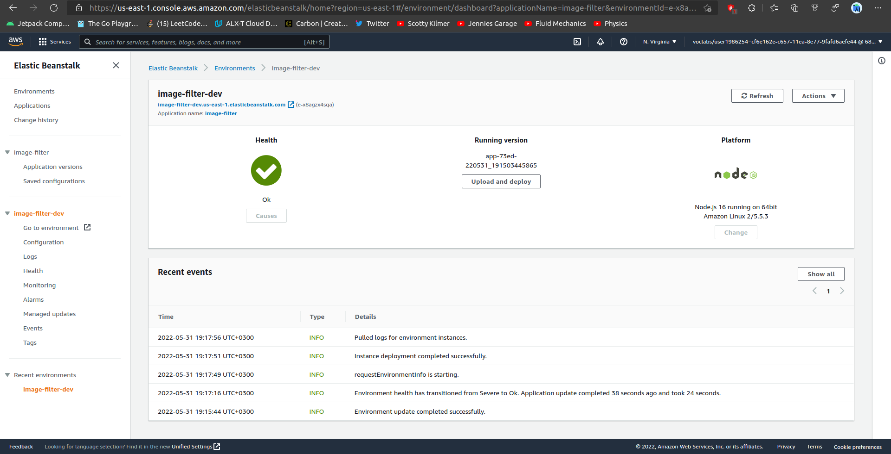

# Udagram Image Filtering Microservice

Udagram is a simple cloud application developed alongside the Udacity Cloud Engineering Nanodegree. It allows users to register and log into a web client, post photos to the feed, and process photos using an image filtering microservice.

[Link to Elastic Beanstalk](http://image-filter-dev.us-east-1.elasticbeanstalk.com)

## Elastic Bean Dashboard [VIEW RAW](deployment_screenshots/eb_screenshot.png)
